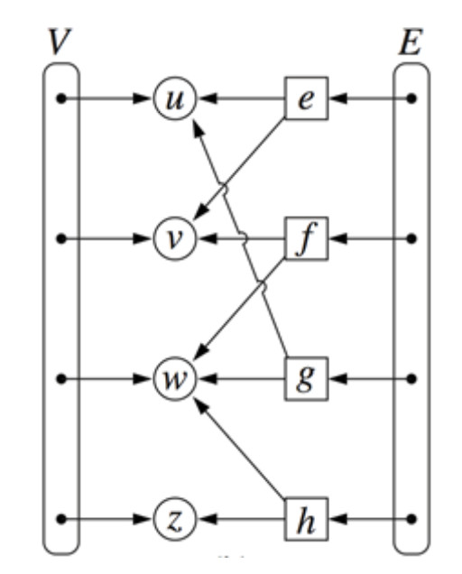

### 그래프의 정의
1. 그래프는 ==공집합이 아닌 정점==과 간선의 집합으로 구성되는 자료구조
2. 경로(path)
- u에서 v로 향하는 길이 n의 경로는, n개의 간선의 순열 e1=(u,$x_1$)... $e_n$=($x_{n-1}$, v)이다.
- 같은 정점에서 시작하고 끝나는 경로를 **사이클** 이라고 한다.
- 사이클이 아닌 경로를 단순 경로(simple path)라고 한다.

3. 차수?(degree)
- 정점 v와 인접한 간선의 수
- undirected vs directed

4. subgraph & connected
- E'이 E에 포함되고 V'이 V의 부분집합인 그래프 G'를 G의 서브그래프라고 부름
- 한 그래프에서 정점에서 다른 정점으로 가는 경로가 항상 존재하면 connected이다
- 트리는 **사이클이 없는 연결된 그래프이다**

5. spanning tree
- 무향 그래프에서, 그래프의 모든 정점을 포함하는 서브그래프를 스패닝 트리라고 부른다.

### 그래프의 표현
1. 인접 행렬 표현(adjacency matrix)

- 행의 수 == 열의 수 == 정점의 수와 같게 한 행렬에서, 각 행 번호의 정점에 대해 각 열 번호의 정점이 인접하면 1, 그렇지 않으면 0으로 나타낸다.
- 인접행렬의 크기는 $O(V^2)$ 이다
- 무향 그래프의 인접행렬에서는 대각선에 의해 선대칭이며, 1의 수는 간선의 수의 2배이다

2. 인접 리스트 표현

- 정점에 인접한 정점들을 하나의 노드로 구성하고, 인접한 노드를 연결 리스트로 표현한다.
- 무향 그래프에서 각 정점의 차수는 정점에 대한 인접리스트에 속한 노드들의 수가 된다
- 무향 그래프에서 인접 리스트의 크기는 $O(E+V)$ 이다.

3. adjacncy multilist

- 인접 리스트를 노드 중심이 아니라 간선 중심으로 구성하는 것
- 각 간선에 대해서 하나의 copy만을 가지므로, 메모리를 절약할 수 있음

4. edge List

- edge list / 인접 리스트 / 인접 행렬 수행 시간 비교

### 그래프의 순회
1. DFS
- 스택/ 재귀로 구현
- 시간 복잡도 : adjacency list로 구현 시 O(V+E)

2. BFS
- 큐로 구현
- 시간 복잡도 : adjacency list로 구현 시 O(V+E)

3. DFS/BFS 응용

### 최소 비용 신장 트리(MST)
1. 개념
- 가중치 그래프에서 신장 트리가 여러 개 있을 수 있는데, 그 중 모든 간선의 길이의 합이 최소인 것을 최소 신장트리라 한다.
- 그래프 G의 신장트리는 그래프 G 내의 ==모든 정점==이 포함되고, ==간선의 수가 n-1==인 ==사이클이 없는== 연결그래프이다.

2. 크루스컬 알고리즘(krusakal)
- 알고리즘
(1) 간선의 길이에 따라 간선을 오름차순으로 정렬한다.(1->2->...)
(2) 간선의 가중치가 작은 순서로 선택하되, 미리 선택된 간선과 결합해 사이클이 만들어 지면 패스
(3) 모든 정점이 연결되어 신장트리가 될 때까지 반복

- 종료 조건?
  - |T| = n-1
  - 정렬된 모든 간선을 한 번씩 훑어보았을 때
    - 이 때 |T| <n-1이면 그래프는 disconnected이므로, MST가 만들어질 수 없다.

- 시간 복잡도
  - 정렬 : O(E log E) > merge sort, heap sort 등을 사용했을 때
  - 사이클 검사

- 사이클 검사에 사용하는 알고리즘
  - DFS/BFS : O(E+V) * O(E) = O(E(E+V)) = O(EV)
  - union-find : O(E log V) (자세한 증명은 생략...ㅠㅠ)

3. 프림 알고리즘
- 알고리즘
(1) 하나의 정점을 선택한다.
(2) 선택한 정점의 간선 중 연결되지 않고, 가장 가중치가 작은 간선을 선택한다.

- 시간 복잡도
  - DFS/BFS : O(EV)
  - heap 사용 시
    - 선택한 정점과 연결된 모든 간선을 heap에 넣는다.
    - heap 에서 하나의 간선을 꺼낸 후, 연결될 수 있는지 비교한다.
    - O(E log V) (마찬가지로 생략...ㅠㅠ)

||크루스칼|프림|
|-|-|-|
|시간 복잡도|O(EV) ~ O(E log V)|O(EV) ~ O(E log V)|
|알고리즘|간선을 중심으로 최소 간선 선택|정점 선택 후 확장|
|용도|희소 그래프|밀집 그래프|

### 위상 정렬(topological sort)
1. 위상 순서(topological order)
- 방향 그래프에서 두 정점 i와 j에 대해 i가 j의 선행자일 때, 정점 i가 정점 j보다 먼저 나오는 정점의 순차 리스트를 말한다.

2. 위상 정렬(topological sort)
- 알고리즘
(1) 그래프에서 선행자가 없는 정점들을 모두 정렬시킨다.
(2) 이 정점과 부속한 간선을 모두 제거한다
(3) (1)의 과정을 반복한다.

- **큐를 사용하여 구현**할 수 있음.

### 최단 경로(shortest path)
1. 다익스트라 알고리즘
- BFS 기반으로 구현하는 DP 알고리즘
- https://ratsgo.github.io/data%20structure&algorithm/2017/11/26/dijkstra/
- $d(z) = min(d(z), d(u) + weight(e))$
- 시간 복잡도 : BFS를 그대로 적용할 시 O($V^2$), 힙 사용 시 O((E+V) log V)

2. 알고리즘
(1) 공집합 S를 만든다
(2) 시작 정점 x를 정하고, 다른 정점을 모두 힙에 넣는다.
(3) x와 연결된 정점 u의 가중치를 업데이트한다.
-https://www.crocus.co.kr/546
